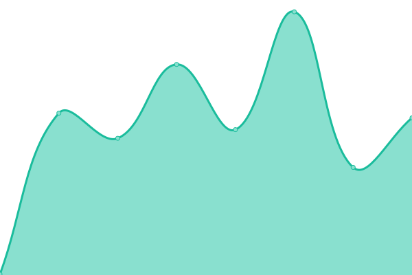
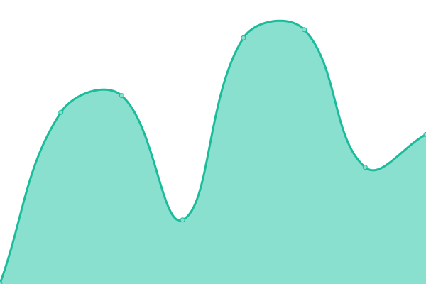

# [📈 Live Status](https://status.gaino.group): <!--live status--> **🟩 All systems operational**

This repository contains the open-source uptime monitor and status page for [tek](gaino.group), powered by [Upptime](https://github.com/upptime/upptime).

With [Upptime](https://upptime.js.org), you can get your own unlimited and free uptime monitor and status page, powered entirely by a GitHub repository. We use [Issues](https://github.com/tekunikaru/grd-comando-status/issues) as incident reports, [Actions](https://github.com/tekunikaru/grd-comando-status/actions) as uptime monitors, and [Pages](https://status.gaino.group) for the status page.

<!--start: status pages-->
<!-- This summary is generated by Upptime (https://github.com/upptime/upptime) -->
<!-- Do not edit this manually, your changes will be overwritten -->
<!-- prettier-ignore -->
| URL | Status | History | Response Time | Uptime |
| --- | ------ | ------- | ------------- | ------ |
|  [Tunnel](https://www.cloudflarestatus.com/api/v2/components.json) | 🟩 Up | [tunnel.yml](https://github.com/tekunikaru/grd-comando-status/commits/HEAD/history/tunnel.yml) | 

 298ms
     
 | 

<a href="https://status.gaino.group/history/tunnel">100.00%</a>
    

|  [HEXANE API](https://uvr.gaino.group) | 🟩 Up | [hexane-api.yml](https://github.com/tekunikaru/grd-comando-status/commits/HEAD/history/hexane-api.yml) | 

 579ms
     
 | 

<a href="https://status.gaino.group/history/hexane-api">98.51%</a>
    

|  [Heber Animes](https://animes.heber.moe) | 🟩 Up | [heber-animes.yml](https://github.com/tekunikaru/grd-comando-status/commits/HEAD/history/heber-animes.yml) | 

 1182ms
     
 | 

<a href="https://status.gaino.group/history/heber-animes">98.51%</a>
    

<!--end: status pages-->

[**Visit our status website →**](https://status.gaino.group)

## 📄 License

- Powered by: [Upptime](https://github.com/upptime/upptime)
- Code: [MIT](./LICENSE) © [tek](gaino.group)
- Data in the `./history` directory: [Open Database License](https://opendatacommons.org/licenses/odbl/1-0/)
